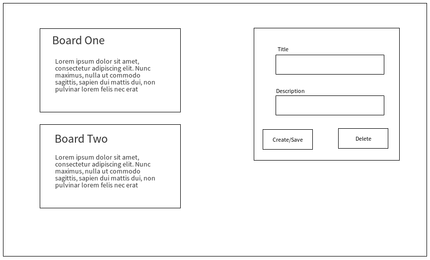

# Design Doc for Notetorious

## Problem Statement

To analyse and look at different ways to implement the master/detail pattern using various JavaScript frameworks.

## Goals

1. To better understand the UI pattern
2. To understand how various frameworks solve the same problem
3. To dive deeper into the practical implementation of the various frameworks

## Non-Goals

## Design

### Overview

Uses a [master/detail](https://en.wikipedia.org/wiki/Master%E2%80%93detail_interface) view.

User enters on a master view of all boards. From this screen boards can be created and edited. If a board is selected the user can then make that board the master view which will then display all associated notes.

## API

## Dependencies

## Testing
