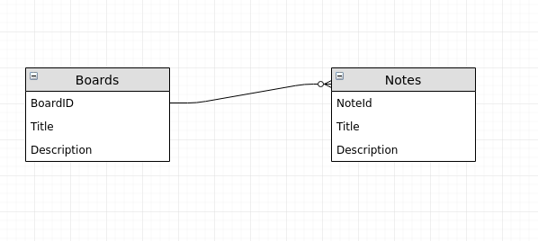

# Design Doc for Notetorious

## Problem Statement

To analyse and look at different ways to implement the master/detail pattern using various JavaScript frameworks.

## Goals

1. To better understand the UI pattern
2. To understand how various frameworks solve the same problem
3. To dive deeper into the practical implementation of the various frameworks

## Non-Goals

## Design

### Overview

Uses a [master/detail](https://en.wikipedia.org/wiki/Master%E2%80%93detail_interface) view.

User enters on a master view of all boards. From this screen boards can be created and edited. If a board is selected the user can then make that board the master view which will then display all associated notes.

In the below wireframe 'Board One' has been selected:

The Boards and Notes have the following relationship:

A board can have many notes and a note can only have one board.

## API

/boards

| Verb   |  Endpoint   |                                          Body | Result                         |
| ------ | :---------: | --------------------------------------------: | ------------------------------ |
| GET    |   /boards   |                                               | returns all boards             |
| POST   |   /search   |                                               | returns boards based on search |
| POST   |   /boards   |                   {title: "" description: ""} | creates a board                |
| PUT    | /boards/:id | { board_id: "1", title?: "" description?: ""} | updates a board                |
| DELETE | /boards/:id |                              { board_id: "1"} | deletes a board                |

/notes

| Verb   |  Endpoint  |                                         Body | Result                        |
| ------ | :--------: | -------------------------------------------: | ----------------------------- |
| GET    |   /notes   |                                              | returns all notes             |
| POST   |  /search   |                                              | returns notes based on search |
| POST   |   /notes   |                  {title: "" description: ""} | creates a note                |
| PUT    | /notes/:id | { note_id: "1", title?: "" description?: ""} | updates a note                |
| DELETE | /notes/:id |                              { note_id: "1"} | deletes a note                |

## Dependencies

## Testing
